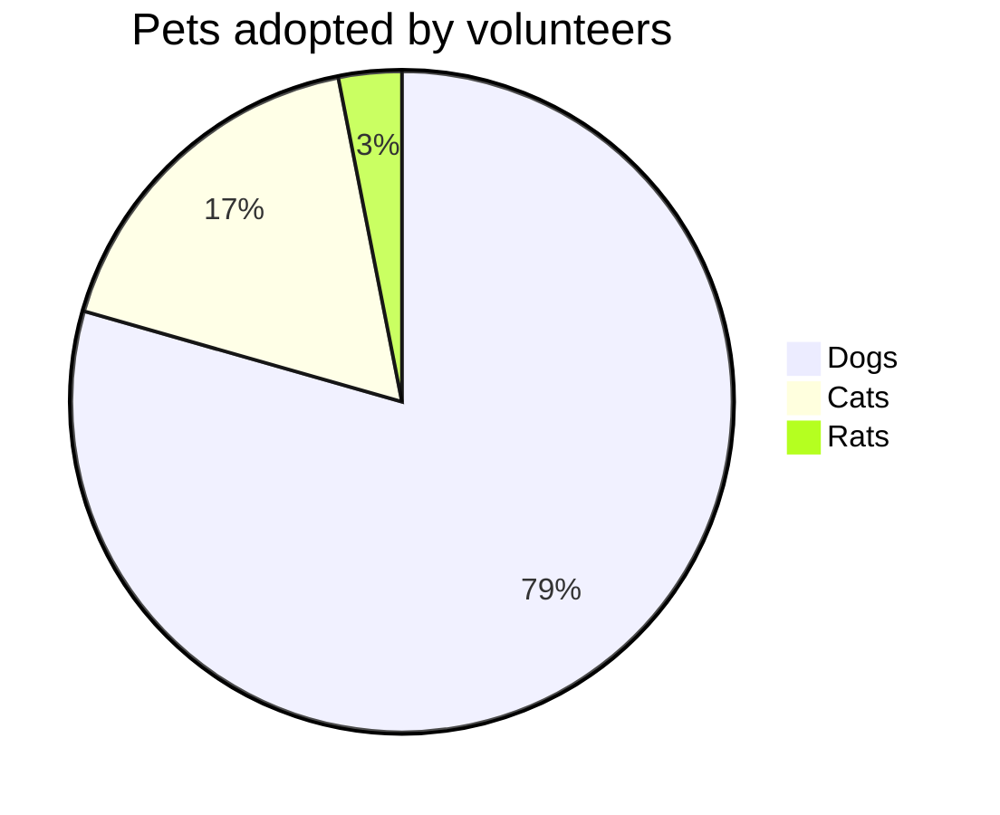
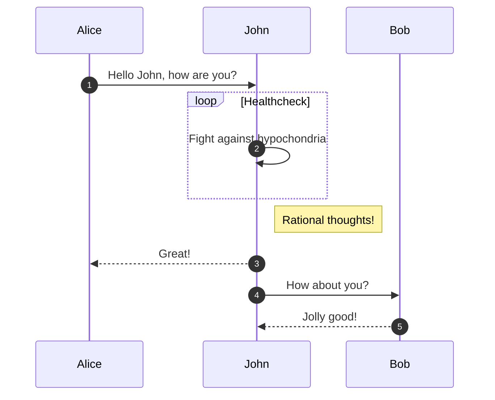
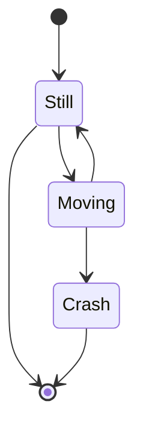
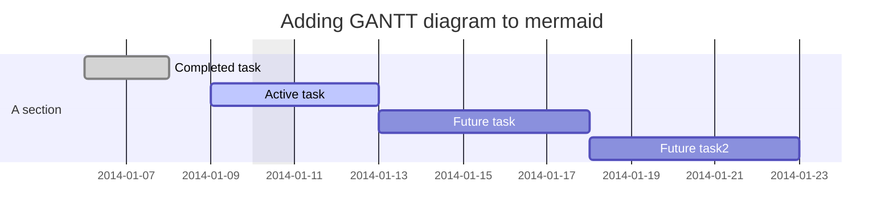
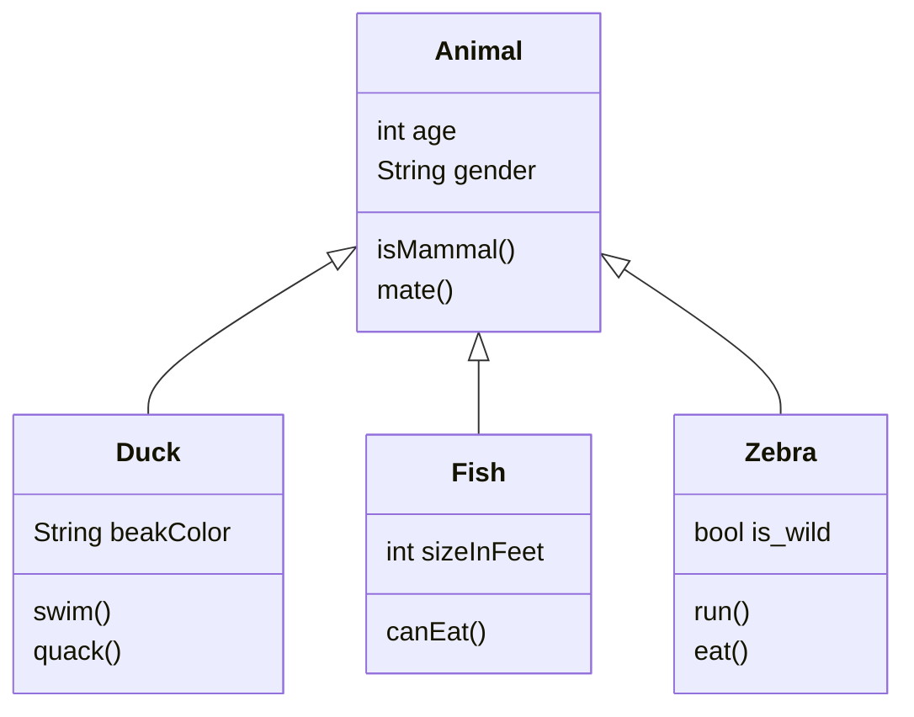

# 在github上畫圖表
## 前言
* 前陣子github開放了mermaid在github上的markdown使用
* mermaid是一個markdown的圖表工具
* 透過簡單的指令可以完成一些我們在工程上會使用到的圖表
## 餅形圖(Pie Chart)

## 流程圖（Flow Chart）

## 時序圖（Sequence Diagram）

## 狀態圖(State Diagram)

## 甘特圖（Gantt Diagram）

## 類圖(class Diagram)

## 後記
* 如要在vscode中show出mermaid的圖形需下載補充軟體
* 輸入mermaid即可找到
## 參考資料
* [Include diagrams in your Markdown files with Mermaid](https://github.blog/2022-02-14-include-diagrams-markdown-files-mermaid/)
* [在Markdown中用mermaid語法繪製圖表](https://www.gushiciku.cn/pl/pP3d/zh-tw)
