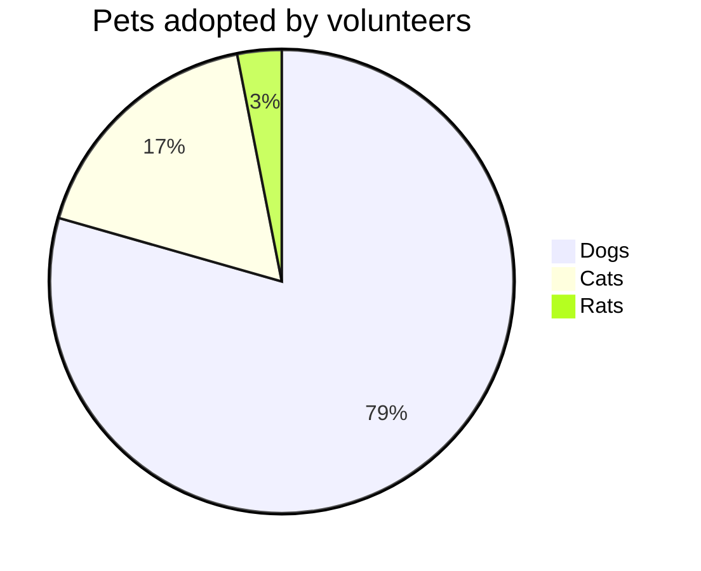
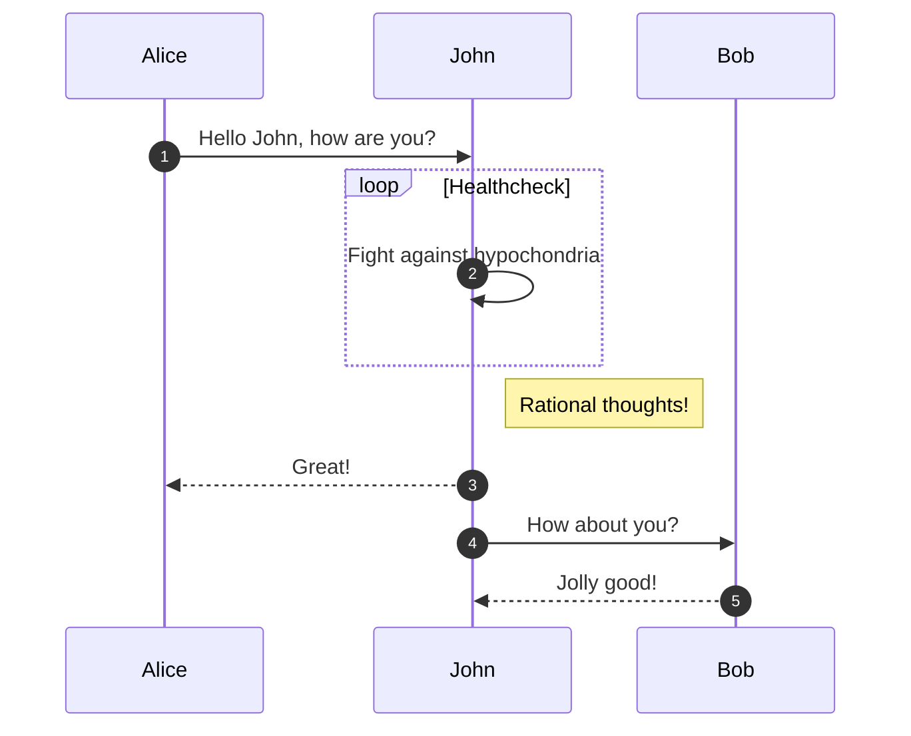
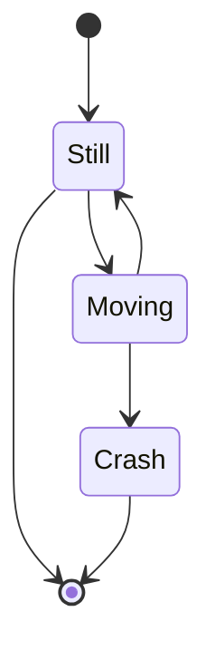
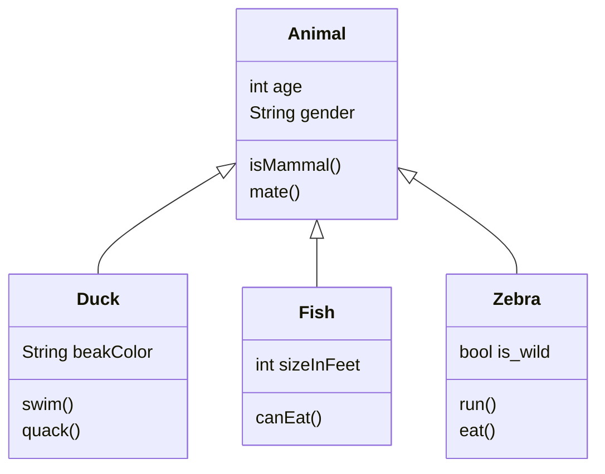

# 在github上畫圖表
## 前言
* 前陣子github開放了mermaid在github上的markdown使用
* mermaid是一個markdown的圖表工具
* 透過簡單的指令可以完成一些我們在工程上會使用到的圖表
* * 如要在vscode中show出mermaid的圖形需下載補充軟體
* 輸入mermaid即可找到
## 餅形圖(Pie Chart)
* 輸入關鍵詞 pie
* title 你想要的主題名稱
* " " : xxxx ex : "dog" : 386

## 流程圖（Flow Chart）
* 輸入關鍵詞 graph TD (上下) 或是 graph RL (左右)
* x-->Y; 表X到Y

## 時序圖（Sequence Diagram）
* 輸入關鍵詞 sequenceDiagram
* 可以利用 autonumber依照輸入指令的先後順序編排
* x->> y: xxxxxxxx 表 x跟y 之間為**實線**有xxxx關係
*  x--> y: xxxxxxxx 表 x跟y 之間為**虛線**有xxxx關係
* loop xxxx 建置一個迴圈名叫xxx 
    * 迴圈內指令與原指令相同
    * end 迴圈內指令結束後輸入end 
    * xxxxxx end後的一行指令表此迴圈的內容說明

## 狀態圖(State Diagram)
* 關鍵詞 stateDiagram
* ```[*]``` 表初始狀態或結束狀態
* 與流程圖類似利用 --> 表流程

## 甘特圖（Gantt Diagram）
* 關鍵詞 gantt
* dataFormat可以設定 YYYY-MM-DD
* title 圖表名稱
* excludes weekdays 排除的日期
* section xxx 表 section的名稱
* xxxxx : done, des1, xxxx-xx-xx,xxxx-xx-xx 什麼事情 : 是否完成(done or active),第幾個任務,什麼時候到什麼時候 or 從某天+n天


## 類圖(class Diagram)
* xxxx <|-- xx 表xx屬xxxx類
* xxxxx: xxxxx 跟 xxxxx:xxxx() 變數跟函數會分開

## 參考資料
* [Include diagrams in your Markdown files with Mermaid](https://github.blog/2022-02-14-include-diagrams-markdown-files-mermaid/)
* [在Markdown中用mermaid語法繪製圖表](https://www.gushiciku.cn/pl/pP3d/zh-tw)
