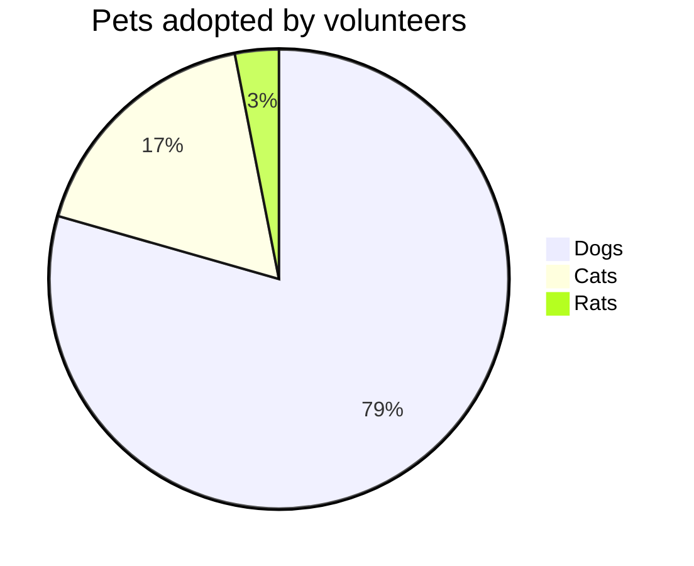
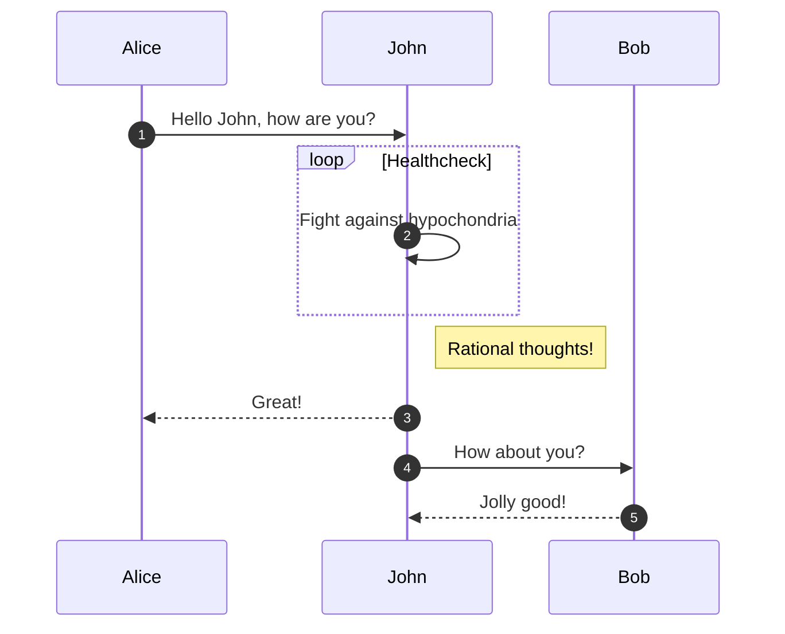
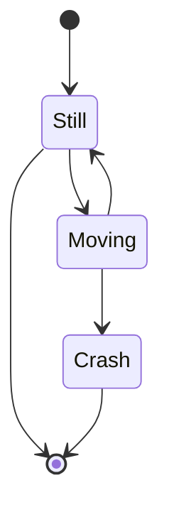

# 在github上畫圖表
## 前言
* 前陣子github開放了mermaid在github上的markdown使用
* mermaid是一個markdown的圖表工具
* 透過簡單的指
## 圓餅圖

```mermaid
    pie 
    title Pets adopted by volunteers
    "Dogs" : 386
    "Cats" : 85
    "Rats" : 15 
```
## 一般流程圖

```mermaid
graph TD;
    A-->B;
    A-->C;
    B-->D;
    C-->D;
```
## 比較複雜的流程圖

```mermaid
sequenceDiagram
    autonumber
    Alice->>John: Hello John, how are you?
    loop Healthcheck
        John->>John: Fight against hypochondria
    end
    Note right of John: Rational thoughts!
    John-->>Alice: Great!
    John->>Bob: How about you?
    Bob-->>John: Jolly good!
```
## 階段圖

```mermaid
stateDiagram
  [*] --> Still
  Still --> [*]
  Still --> Moving
  Moving --> Still
  Moving --> Crash
  Crash --> [*]
```
