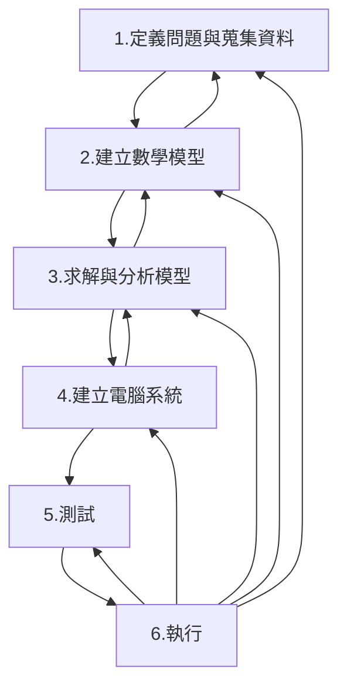

# 第一章: 概論
## 目錄:
1. 作業研究的本質
2. 作業研究的起源
3. 作業研究的發展
4. 作業研究的應用
5. 作業研究應用的執行程序
### OR的本質
* 定義:  利用計量方法與系統方式**分析決策**內容，以提供的決策
* 特性:
  * 使用科學的方法: 觀察問題、蒐集數據資料、建立數學模型、求解
  * 採用系統方式: 系統包含共同運作之其他相關連部分，系統方式則是以整體的觀點去考量，整體共同利益大於個別部分利益。
  * 探討決策問題: 與管理科學、決策科學交互使用
  * 作業研究團隊: 透過不同的角度觀察和解決問題
### OR起源
* 根源: 二十世紀初
   * henry gantt於1900年發展甘特圖
   * Ford Harris於1915提出經濟訂購批量(EOQ)公式
   * A.K.Erlang於1917推導出分析電話自動撥號設備問題的公式
* 發展: 二戰時期
  * 英國徵招各領域高手，以科學的方式研究軍事上各種戰略及戰術問題
* 戰後OR蓬勃發展的因素: 擴展至工業、企業界
  1. 許多OR的重要方法陸續發展出來
    * George Dantzig發展單行法
    * 動態規劃、等候理論、存貸控制等
  2. 電腦快速的發展
    * 許多方法需要大量運算，電腦強大的計算能力協助解決問題 
### OR的發展
* 早期: 以工業工程科系為主，特別是製造業為研究主題
* 現: 商管學院及其他工程、公衛等皆經常開設相關課程
* 最早的協會: 美國作業研究學會 (ORSA ; Operations Research Society of America)
### OR應用
| 領域 | 應用問題 |
|:----:|:--------:|
| 財務 | 財務規劃與分析  專案選擇  投資組合管理  現金流量的管理  長期經濟與財務的預測  |
| 行銷 | 銷售區域配置  行銷目錄與網頁商品位置及大小決定   廣告媒體的選擇   配銷與倉儲中心的位置選擇 |
| 生產管理 | 存貸管理  生產排程與產能規劃  工程人員排班  機器維修及預防保養  生產設施位置與數量決定 |
| 服務業管理 | 飛機燃料規劃與安排  航空公司空勤與地勤人員的排班  租車公司的車輛派遣作業管理  物流公司車利路線規劃  旅館訂房或飛機定位安排  醫院病人菜單規劃
| 政府 | 法院對出庭審訊案件安排  學校上課教室安排  郵差、清潔車、鏟雪車的路線規劃  軍隊兵員招募  水與空氣污染管制  種族平衡問題
### OR應用的執行程序
* 流程圖

1. 定義問題與蒐集資料
  * 
2. 建立數學模型
3. 求解與分析模型
4. 建立電腦系統
5. 測試
6. 執行
